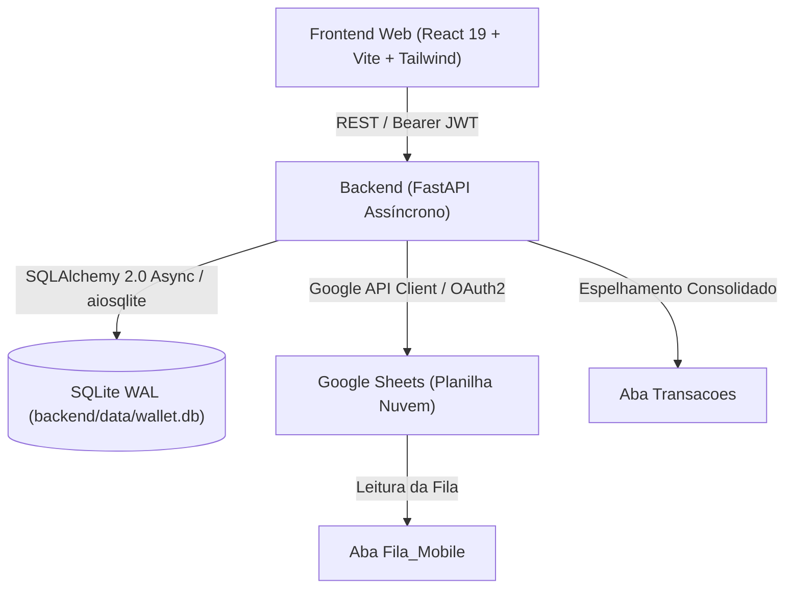

# Wallet - Arquitetura Técnica (.ai/ARCHITECTURE.md)

## 1. Diagrama Geral do Sistema



---

## 2. Componentes do Backend

### 2.1 Stack & Bibliotecas
- **Linguagem**: Python 3.10+
- **Framework Web**: FastAPI `>= 0.111.0`
- **Servidor ASGI**: Uvicorn `[standard]`
- **ORM & Persistência**: SQLAlchemy 2.0 Async + `aiosqlite`
- **Validação de Dados**: Pydantic v2 + `pydantic-settings`
- **Segurança & Criptografia**: `passlib[bcrypt]` nativo + `python-jose` (JWT HS256)
- **Integração Google Sheets**: `google-api-python-client`, `google-auth-httplib2`, `google-auth-oauthlib`

### 2.2 Estrutura de Diretórios
```
backend/
├── app/
│   ├── api/
│   │   └── v1/            # Endpoints REST (auth, accounts, categories, items, contacts, debts, etc.)
│   ├── core/
│   │   ├── config.py      # Configurações via variáveis de ambiente (.env)
│   │   └── security.py    # Utilitários de hash bcrypt e criação/validação de tokens JWT
│   ├── models/            # Modelos declarativos SQLAlchemy (User, Category, Item, Transaction, etc.)
│   ├── schemas/           # Schemas Pydantic para validação de entrada e serialização de saída
│   ├── services/          # Regras de negócio (ScheduleService, GoogleSheetsService)
│   ├── database.py        # Configuração de AsyncEngine SQLite WAL e sessão AsyncSession
│   └── main.py            # Instância FastAPI, CORS, migrações dinâmicas e lifespan com seeding
├── data/
│   └── wallet.db          # Arquivo do banco de dados SQLite local
├── requirements.txt       # Dependências Python
└── venv/                  # Ambiente virtual isolado
```

### 2.3 Convenções de Endpoints REST

| Recurso | Método | Rota | Descrição |
| :--- | :--- | :--- | :--- |
| **Auth** | `POST` | `/api/v1/auth/login` | Login com usuário e senha, retornando token JWT Bearer. |
| **Auth** | `GET` | `/api/v1/auth/me` | Retorna dados do usuário autenticado atual. |
| **Usuários** | `GET` | `/api/v1/auth/users` | Listagem de usuários do sistema (interno/autenticado). |
| **Usuários** | `POST` | `/api/v1/auth/register` | Cadastro de novos usuários (interno/autenticado). |
| **Usuários** | `DELETE` | `/api/v1/auth/users/{id}` | Exclusão de usuário com proteção do último admin. |
| **Contas** | `GET` / `POST` | `/api/v1/accounts` | Gestão de contas bancárias e carteiras por perfil. |
| **Categorias**| `GET` / `POST` | `/api/v1/categories` | Gestão de categorias e subcategorias com natureza. |
| **Categorias**| `GET` | `/api/v1/categories/tree` | Consulta hierárquica agrupada em árvore (pais e filhos). |
| **Itens** | `GET` / `POST` | `/api/v1/items` | Cadastro e listagem de itens vinculados a subcategorias. |
| **Contatos** | `GET` / `POST` | `/api/v1/contacts` | Gestão de clientes, fornecedores e prestadores. |
| **Dívidas** | `GET` / `POST` | `/api/v1/debts` | Gestão de passivos e acompanhamento de amortização. |
| **Orçamentos**| `GET` / `POST` | `/api/v1/budgets` | Tetos de gastos mensais e cálculo de realizados. |
| **Transações**| `GET` / `POST` | `/api/v1/transactions` | Lançamentos de despesas e receitas. |
| **Schedules** | `GET` / `POST` | `/api/v1/schedules` | Agendamentos recorrentes e parcelamentos em N vezes. |
| **Dashboard** | `GET` | `/api/v1/dashboard/summary`| Métricas consolidadas, KPIs, projeções e alertas. |
| **Sync** | `GET` / `POST` | `/api/v1/sync/config` | Leitura e atualização das credenciais e ID da planilha. |
| **Sync** | `POST` | `/api/v1/sync/test` | Teste de autenticação com a API do Google Sheets. |
| **Sync** | `POST` | `/api/v1/sync/export` | Exportação de transações do SQLite para a aba `Transacoes`. |
| **Sync** | `POST` | `/api/v1/sync/import` | Importação e processamento da aba `Fila_Mobile` para o SQLite. |
| **Sync** | `POST` | `/api/v1/sync/full` | Sincronização completa (importação + exportação consolidada). |
| **Sync** | `GET` | `/api/v1/sync/logs` | Histórico e logs de auditoria de sincronização. |

---

## 3. Integração com Google Sheets (Espelho Integral & Base App Mobile)

### 3.1 Estrutura das 8 Abas da Planilha
1. **`Transacoes`**: Espelho analítico completo de todas as receitas e despesas com metadados, valores em R$ e centavos, IDs e referências.
2. **`Categorias`**: Árvore hierárquica completa (categorias e subcategorias), tipo de fluxo e natureza de essencialidade.
3. **`Itens`**: Catálogo de itens vinculados a subcategorias com valor padrão sugerido.
4. **`Contas`**: Contas bancárias, carteiras e aplicações cadastradas.
5. **`Contatos`**: Cadastro consolidado de clientes, fornecedores e favorecidos.
6. **`Dividas`**: Passivos, credores, valor total/restante, status e vencimentos.
7. **`Orcamentos`**: Tetos e limites mensais de gastos por categoria.
8. **`Fila_Mobile`**: Fila de recepção para lançamentos inseridos remotamente pelo app mobile Android.

### 3.2 Otimização em Lote (Batch Operations)
- Utilização de `batchClear` e `values.batchUpdate` para exportar todas as 7 abas mestras em uma única chamada de API atômica, evitando *rate limits*.
- Criação e inicialização automática de abas ausentes via `ensure_all_sheets_exist`.

---

## 4. Componentes do Frontend

### 4.1 Stack & Bibliotecas
- **Framework**: React 19 + TypeScript
- **Bundler / Dev Server**: Vite 8+
- **Estilização**: Tailwind CSS 3.4 + PostCSS
- **Ícones**: Lucide React
- **Cliente HTTP**: Axios com interceptor de autenticação JWT Bearer e tratamento centralizado de erros.

### 4.2 Estrutura de Diretórios
```
frontend/
├── src/
│   ├── api/
│   │   └── client.ts            # Instância Axios com interceptors de Auth
│   ├── components/
│   │   ├── Header.tsx           # Cabeçalho com perfil, tema, sync e logout
│   │   └── TransactionModal.tsx # Modal para lançamentos únicos, parcelados e recorrentes
│   ├── context/
│   │   └── AppContext.tsx       # Contexto global (perfil, dark mode, login theme, hide values)
│   ├── pages/
│   │   ├── Dashboard.tsx        # KPIs, alertas e maiores despesas por categoria
│   │   ├── Transactions.tsx     # Tabela de lançamentos, filtros e ações
│   │   ├── Management.tsx       # Cadastros (Categorias, Itens, Contatos, Dívidas, Orçamentos)
│   │   └── Settings.tsx         # Configurações (Aparência & Login, Gestão de Usuários, Sincronização)
│   ├── types/
│   │   └── index.ts             # Definições de interfaces e tipos TypeScript
│   ├── utils/
│   │   └── format.ts            # Formatação monetária (BRL) e máscara de valores
│   ├── App.tsx                  # Layout principal e AuthScreen com tema dinâmico
│   ├── index.css                # Configuração do Tailwind e variáveis de tema
│   └── main.tsx                 # Ponto de entrada React 19
├── tailwind.config.js           # Configuração de temas e Dark Mode
└── package.json                 # Dependências e scripts
```
