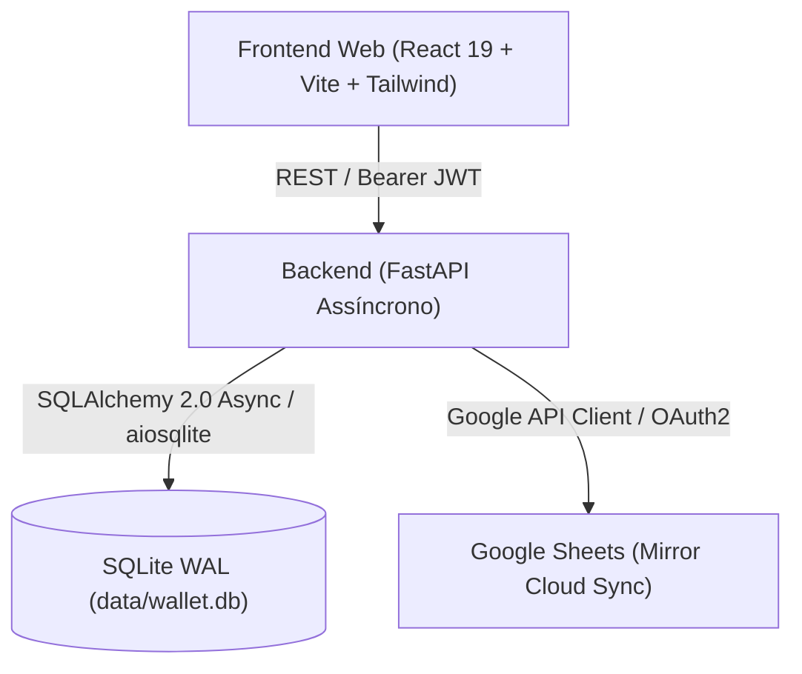

# Wallet - Arquitetura Técnica

## 1. Diagrama Geral do Sistema



---

## 2. Componentes do Backend

### 2.1 Stack & Bibliotecas
- **Linguagem**: Python 3.10+
- **Framework Web**: FastAPI `>= 0.111.0`
- **Servidor ASGI**: Uvicorn `[standard]`
- **ORM & Banco**: SQLAlchemy 2.0 Async + `aiosqlite`
- **Validação de Schemas**: Pydantic v2 + `pydantic-settings`
- **Segurança & Criptografia**: `bcrypt` nativo (hashing) + `python-jose` (tokens JWT HS256)
- **Integração Google**: `google-api-python-client`, `google-auth-httplib2`, `google-auth-oauthlib`

### 2.2 Estrutura de Diretórios
```
backend/
├── app/
│   ├── api/
│   │   └── v1/            # Endpoints REST (auth, accounts, categories, contacts, debts, etc.)
│   ├── core/
│   │   ├── config.py      # Configurações via variáveis de ambiente (.env)
│   │   └── security.py    # Utilitários de hash bcrypt e criação/validação de tokens JWT
│   ├── models/            # Modelos declarativos SQLAlchemy (User, Category, Transaction, etc.)
│   ├── schemas/           # Schemas Pydantic para validação de entrada e serialização de saída
│   ├── services/          # Regras de negócio (ScheduleService, GoogleSheetsService)
│   ├── database.py        # Configuração de AsyncEngine SQLite WAL e sessão AsyncSession
│   └── main.py            # Instância FastAPI, CORS, rotas e lifespan com seeding inicial
├── data/
│   └── wallet.db          # Arquivo do banco de dados SQLite local
├── requirements.txt       # Dependências Python
└── venv/                  # Ambiente virtual isolado
```

### 2.3 Modelo de Dados
- **Users**: Usuários com credenciais criptografadas.
- **Accounts**: Carteiras e contas bancárias (Corrente, Poupança, Caixa, etc.).
- **Categories**: Categorias hierárquicas separadas por perfil (`PESSOAL`/`EMPRESA`) e tipo (`RECEITA`/`DESPESA`).
- **Contacts**: Clientes, fornecedores e prestadores com CPF/CNPJ.
- **Debts**: Passivos financeiros com controle de amortização e saldo devedor restante.
- **Schedules**: Regras de recorrência e parcelamentos em N vezes com criação de agendamentos.
- **Transactions**: Lançamentos realizados ou previstos, com status (`PENDENTE`/`CONCLUIDO`), data de vencimento e quitação.
- **Budgets**: Tetos de gastos mensais por categoria com acompanhamento percentual.
- **SystemConfigs**: Armazenamento seguro de parâmetros do sistema (`google_spreadsheet_id`, `google_credentials_json`).
- **SyncLogs**: Registro de auditoria das operações de sincronização com o Google Sheets (`action`, `status`, `items_imported`, `items_exported`, `message`, `details`).

---

## 3. Componentes do Frontend

### 3.1 Stack & Bibliotecas
- **Framework**: React 19 + TypeScript
- **Bundler / Dev Server**: Vite 8+
- **Estilização**: Tailwind CSS 3.4 + PostCSS + Autoprefixer
- **Ícones**: Lucide React
- **Cliente HTTP**: Axios com interceptor de tokens JWT e tratamento automático de 401

### 3.2 Estrutura de Diretórios
```
frontend/
├── src/
│   ├── api/
│   │   └── client.ts            # Instância Axios com interceptors de Auth
│   ├── components/
│   │   ├── Header.tsx           # Cabeçalho com perfil, tema, sync e logout
│   │   └── TransactionModal.tsx # Modal para lançamentos únicos, parcelados e recorrentes
│   ├── context/
│   │   └── AppContext.tsx       # Contexto global (perfil, dark mode, hide values, token)
│   ├── pages/
│   │   ├── Dashboard.tsx        # KPIs, alertas e maiores despesas por categoria
│   │   ├── Transactions.tsx     # Tabela de lançamentos, filtros e ações
│   │   ├── Management.tsx       # Cadastros Financeiros (Categorias, Contatos, Dívidas, Orçamentos)
│   │   └── Settings.tsx         # Configurações (Aparência/Login, Gestão de Usuários, Sincronização)
│   ├── types/
│   │   └── index.ts             # Definições de tipos TypeScript compartilhadas
│   ├── utils/
│   │   └── format.ts            # Formatação monetária (BRL) e máscara de valores
│   ├── App.tsx                  # Layout principal com 4 abas e tela de autenticação dinâmica
│   ├── index.css                # Configuração do Tailwind e temas
│   └── main.tsx                 # Entrada React 19
├── index.html                   # Estrutura HTML5 com Google Fonts
├── tailwind.config.js           # Configuração de temas e modo dark
├── tsconfig.json                # Configurações TypeScript
└── package.json                 # Dependências e scripts
```

---

## 4. Segurança e Privacidade (Local-First)
- Todas as operações são executadas contra o banco de dados SQLite local no próprio ambiente do usuário.
- O espelhamento com o Google Sheets é opcional e controlado pelo usuário via botão de sincronização manual ou jobs de backup.
